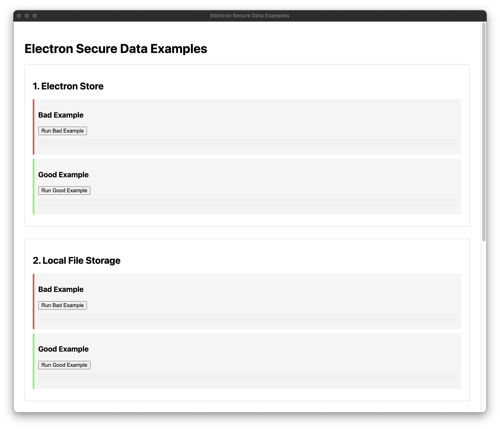
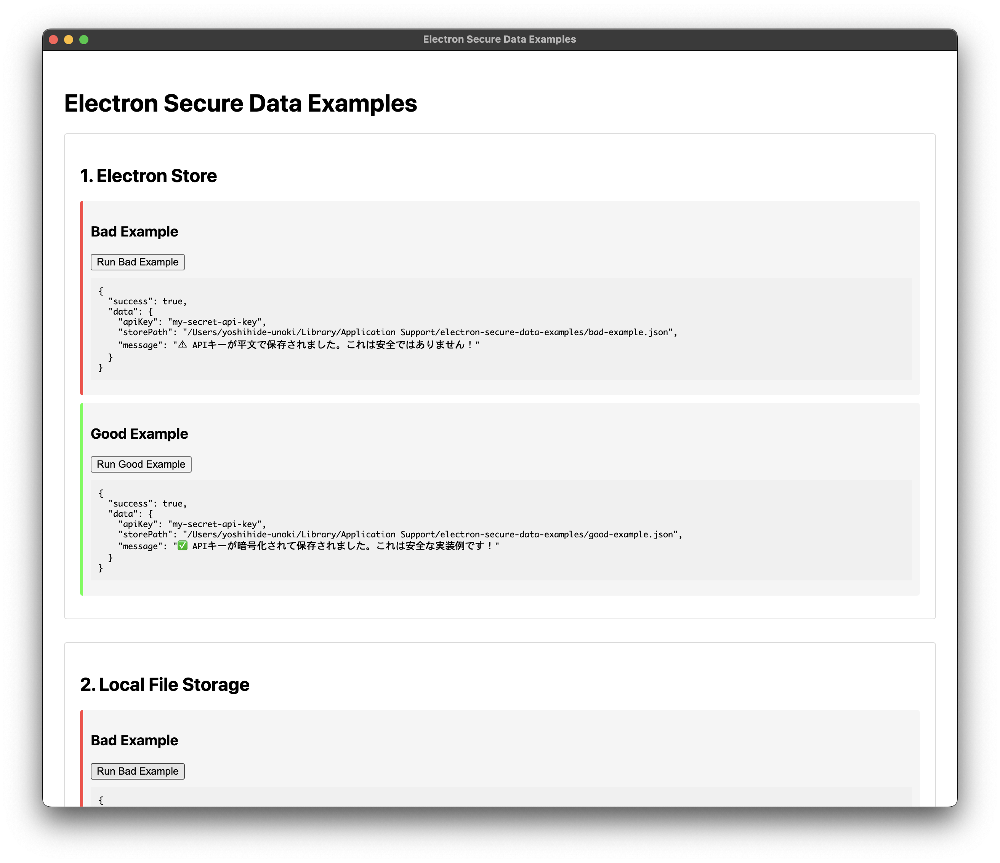

# Electron Secure Data Examples

このリポジトリでは、Electronアプリで安全にデータを保存するための良い実装例と悪い実装例を紹介しています。初心者向けに分かりやすく、各保存方法ごとに整理しています。




## ディレクトリ構成

```
examples/
│-- electron-store/          # Electron Storeの例
│-- local-file/              # ローカルファイル保存の例
│-- sqlite-nedb/             # SQLiteやNeDBの例
│-- os-secure-storage/       # OSセキュアストレージの例
```


## 必要要件

- Node.js 14.0.0以上
- パッケージマネージャー（npm、yarn、またはpnpm）


## 保存方法の一覧

1. **Electron Store**  
   設定情報や軽量なデータの保存に最適
2. **ローカルファイル保存**  
   ファイルベースのデータ管理の基本例
3. **SQLiteやNeDB**  
   構造化データの安全な保存方法
4. **OSセキュアストレージ**  
   機密情報を安全に保存するベストプラクティス


## 使用方法

### クローンしてローカルで実行する

※Node.jsのバージョンは14.0.0以上が必要です。

```bash
# 環境構築
$ git clone https://github.com/nokki-y/electron-secure-data-examples.git
$ cd electron-secure-data-examples
$ npm install
# または
$ yarn install
# または
$ pnpm install

# アプリケーションの実行
$ npm run start
# または
$ yarn start
# または
$ pnpm start
```

実行するとアプリが起動し、以下のような表示されます。

#### デフォルト表示


#### データ保存実行後の表示




## ライセンス

このプロジェクトは [MIT ライセンス](LICENSE) の下で公開されています。
